# Projects and dependencies analysis

This document provides a comprehensive overview of the projects and their dependencies in the context of upgrading to .NETCoreApp,Version=v10.0.

## Table of Contents

- [Executive Summary](#executive-Summary)
  - [Highlevel Metrics](#highlevel-metrics)
  - [Projects Compatibility](#projects-compatibility)
  - [Package Compatibility](#package-compatibility)
  - [API Compatibility](#api-compatibility)
- [Aggregate NuGet packages details](#aggregate-nuget-packages-details)
- [Top API Migration Challenges](#top-api-migration-challenges)
  - [Technologies and Features](#technologies-and-features)
  - [Most Frequent API Issues](#most-frequent-api-issues)
- [Projects Relationship Graph](#projects-relationship-graph)
- [Project Details](#project-details)

  - [docker-compose.dcproj](#docker-composedcproj)
  - [src\Api\Dfe.Complete.Api.Client\Dfe.Complete.Api.Client.csproj](#srcapidfecompleteapiclientdfecompleteapiclientcsproj)
  - [src\Api\Dfe.Complete.Api\Dfe.Complete.Api.csproj](#srcapidfecompleteapidfecompleteapicsproj)
  - [src\Core\Dfe.Complete.Application\Dfe.Complete.Application.csproj](#srccoredfecompleteapplicationdfecompleteapplicationcsproj)
  - [src\Core\Dfe.Complete.Domain\Dfe.Complete.Domain.csproj](#srccoredfecompletedomaindfecompletedomaincsproj)
  - [src\Core\Dfe.Complete.Infrastructure\Dfe.Complete.Infrastructure.csproj](#srccoredfecompleteinfrastructuredfecompleteinfrastructurecsproj)
  - [src\Core\Dfe.Complete.Utils\Dfe.Complete.Utils.csproj](#srccoredfecompleteutilsdfecompleteutilscsproj)
  - [src\Frontend\Dfe.Complete.Logging\Dfe.Complete.Logging.csproj](#srcfrontenddfecompleteloggingdfecompleteloggingcsproj)
  - [src\Frontend\Dfe.Complete.UserContext\Dfe.Complete.UserContext.csproj](#srcfrontenddfecompleteusercontextdfecompleteusercontextcsproj)
  - [src\Frontend\Dfe.Complete\Dfe.Complete.csproj](#srcfrontenddfecompletedfecompletecsproj)
  - [src\Tests\Dfe.Complete.Api.Tests.Integration\Dfe.Complete.Api.Tests.Integration.csproj](#srctestsdfecompleteapitestsintegrationdfecompleteapitestsintegrationcsproj)
  - [src\Tests\Dfe.Complete.Application.Tests\Dfe.Complete.Application.Tests.csproj](#srctestsdfecompleteapplicationtestsdfecompleteapplicationtestscsproj)
  - [src\Tests\Dfe.Complete.Domain.Tests\Dfe.Complete.Domain.Tests.csproj](#srctestsdfecompletedomaintestsdfecompletedomaintestscsproj)
  - [src\Tests\Dfe.Complete.Tests.Common\Dfe.Complete.Tests.Common.csproj](#srctestsdfecompletetestscommondfecompletetestscommoncsproj)
  - [src\Tests\Dfe.Complete.Tests\Dfe.Complete.Tests.csproj](#srctestsdfecompletetestsdfecompletetestscsproj)
  - [src\Tests\Dfe.Complete.UserContext.Tests\Dfe.Complete.UserContext.Tests.csproj](#srctestsdfecompleteusercontexttestsdfecompleteusercontexttestscsproj)

## Executive Summary

### Highlevel Metrics

| Metric | Count | Status |
| :--- | :---: | :--- |
| Total Projects | 16 | All require upgrade |
| Total NuGet Packages | 92 | 36 need upgrade |
| Total Code Files | 1291 |  |
| Total Code Files with Incidents | 42 |  |
| Total Lines of Code | 116085 |  |
| Total Number of Issues | 1837 |  |
| Estimated LOC to modify | 1772+ | at least 1.5% of codebase |

### Projects Compatibility

| Project | Target Framework | Difficulty | Package Issues | API Issues | Est. LOC Impact | Description |
| :--- | :---: | :---: | :---: | :---: | :---: | :--- |
| [docker-compose.dcproj](#docker-composedcproj) | net8.0 | 🟢 Low | 0 | 0 |  | DotNetCoreApp, Sdk Style = True |
| [src\Api\Dfe.Complete.Api.Client\Dfe.Complete.Api.Client.csproj](#srcapidfecompleteapiclientdfecompleteapiclientcsproj) | net8.0 | 🟢 Low | 6 | 1597 | 1597+ | ClassLibrary, Sdk Style = True |
| [src\Api\Dfe.Complete.Api\Dfe.Complete.Api.csproj](#srcapidfecompleteapidfecompleteapicsproj) | net8.0 | 🟢 Low | 8 | 4 | 4+ | AspNetCore, Sdk Style = True |
| [src\Core\Dfe.Complete.Application\Dfe.Complete.Application.csproj](#srccoredfecompleteapplicationdfecompleteapplicationcsproj) | net8.0 | 🟢 Low | 5 | 7 | 7+ | ClassLibrary, Sdk Style = True |
| [src\Core\Dfe.Complete.Domain\Dfe.Complete.Domain.csproj](#srccoredfecompletedomaindfecompletedomaincsproj) | net8.0 | 🟢 Low | 0 | 2 | 2+ | ClassLibrary, Sdk Style = True |
| [src\Core\Dfe.Complete.Infrastructure\Dfe.Complete.Infrastructure.csproj](#srccoredfecompleteinfrastructuredfecompleteinfrastructurecsproj) | net8.0 | 🟢 Low | 8 | 33 | 33+ | ClassLibrary, Sdk Style = True |
| [src\Core\Dfe.Complete.Utils\Dfe.Complete.Utils.csproj](#srccoredfecompleteutilsdfecompleteutilscsproj) | net8.0 | 🟢 Low | 0 | 0 |  | ClassLibrary, Sdk Style = True |
| [src\Frontend\Dfe.Complete.Logging\Dfe.Complete.Logging.csproj](#srcfrontenddfecompleteloggingdfecompleteloggingcsproj) | net8.0 | 🟢 Low | 2 | 0 |  | ClassLibrary, Sdk Style = True |
| [src\Frontend\Dfe.Complete.UserContext\Dfe.Complete.UserContext.csproj](#srcfrontenddfecompleteusercontextdfecompleteusercontextcsproj) | net8.0 | 🟢 Low | 1 | 0 |  | ClassLibrary, Sdk Style = True |
| [src\Frontend\Dfe.Complete\Dfe.Complete.csproj](#srcfrontenddfecompletedfecompletecsproj) | net8.0 | 🟢 Low | 5 | 31 | 31+ | AspNetCore, Sdk Style = True |
| [src\Tests\Dfe.Complete.Api.Tests.Integration\Dfe.Complete.Api.Tests.Integration.csproj](#srctestsdfecompleteapitestsintegrationdfecompleteapitestsintegrationcsproj) | net8.0 | 🟢 Low | 4 | 19 | 19+ | DotNetCoreApp, Sdk Style = True |
| [src\Tests\Dfe.Complete.Application.Tests\Dfe.Complete.Application.Tests.csproj](#srctestsdfecompleteapplicationtestsdfecompleteapplicationtestscsproj) | net8.0 | 🟢 Low | 2 | 0 |  | DotNetCoreApp, Sdk Style = True |
| [src\Tests\Dfe.Complete.Domain.Tests\Dfe.Complete.Domain.Tests.csproj](#srctestsdfecompletedomaintestsdfecompletedomaintestscsproj) | net8.0 | 🟢 Low | 0 | 0 |  | DotNetCoreApp, Sdk Style = True |
| [src\Tests\Dfe.Complete.Tests.Common\Dfe.Complete.Tests.Common.csproj](#srctestsdfecompletetestscommondfecompletetestscommoncsproj) | net8.0 | 🟢 Low | 5 | 0 |  | DotNetCoreApp, Sdk Style = True |
| [src\Tests\Dfe.Complete.Tests\Dfe.Complete.Tests.csproj](#srctestsdfecompletetestsdfecompletetestscsproj) | net8.0 | 🟢 Low | 2 | 79 | 79+ | DotNetCoreApp, Sdk Style = True |
| [src\Tests\Dfe.Complete.UserContext.Tests\Dfe.Complete.UserContext.Tests.csproj](#srctestsdfecompleteusercontexttestsdfecompleteusercontexttestscsproj) | net8.0 | 🟢 Low | 1 | 0 |  | DotNetCoreApp, Sdk Style = True |

### Package Compatibility

| Status | Count | Percentage |
| :--- | :---: | :---: |
| ✅ Compatible | 56 | 60.9% |
| ⚠️ Incompatible | 9 | 9.8% |
| 🔄 Upgrade Recommended | 27 | 29.3% |
| ***Total NuGet Packages*** | ***92*** | ***100%*** |

### API Compatibility

| Category | Count | Impact |
| :--- | :---: | :--- |
| 🔴 Binary Incompatible | 16 | High - Require code changes |
| 🟡 Source Incompatible | 121 | Medium - Needs re-compilation and potential conflicting API error fixing |
| 🔵 Behavioral change | 1635 | Low - Behavioral changes that may require testing at runtime |
| ✅ Compatible | 281012 |  |
| ***Total APIs Analyzed*** | ***282784*** |  |

## Aggregate NuGet packages details

| Package | Current Version | Suggested Version | Projects | Description |
| :--- | :---: | :---: | :--- | :--- |
| Ardalis.GuardClauses | 4.6.0 |  | [Dfe.Complete.Logging.csproj](#srcfrontenddfecompleteloggingdfecompleteloggingcsproj) [Dfe.Complete.UserContext.csproj](#srcfrontenddfecompleteusercontextdfecompleteusercontextcsproj) | ✅Compatible |
| Asp.Versioning.Mvc | 8.1.1 |  | [Dfe.Complete.Api.csproj](#srcapidfecompleteapidfecompleteapicsproj) | ✅Compatible |
| Asp.Versioning.Mvc.ApiExplorer | 8.1.1 |  | [Dfe.Complete.Api.csproj](#srcapidfecompleteapidfecompleteapicsproj) | ✅Compatible |
| AutoFixture | 4.18.1 |  | [Dfe.Complete.Application.Tests.csproj](#srctestsdfecompleteapplicationtestsdfecompleteapplicationtestscsproj) [Dfe.Complete.Tests.Common.csproj](#srctestsdfecompletetestscommondfecompletetestscommoncsproj) [Dfe.Complete.Tests.csproj](#srctestsdfecompletetestsdfecompletetestscsproj) [Dfe.Complete.UserContext.Tests.csproj](#srctestsdfecompleteusercontexttestsdfecompleteusercontexttestscsproj) | ✅Compatible |
| AutoFixture.AutoMoq | 4.18.1 |  | [Dfe.Complete.Application.Tests.csproj](#srctestsdfecompleteapplicationtestsdfecompleteapplicationtestscsproj) [Dfe.Complete.Tests.csproj](#srctestsdfecompletetestsdfecompletetestscsproj) [Dfe.Complete.UserContext.Tests.csproj](#srctestsdfecompleteusercontexttestsdfecompleteusercontexttestscsproj) | ✅Compatible |
| AutoFixture.AutoNSubstitute | 4.18.1 |  | [Dfe.Complete.Tests.Common.csproj](#srctestsdfecompletetestscommondfecompletetestscommoncsproj) | ✅Compatible |
| AutoFixture.Idioms | 4.18.1 |  | [Dfe.Complete.UserContext.Tests.csproj](#srctestsdfecompleteusercontexttestsdfecompleteusercontexttestscsproj) | ✅Compatible |
| AutoFixture.Xunit2 | 4.18.1 |  | [Dfe.Complete.Tests.Common.csproj](#srctestsdfecompletetestscommondfecompletetestscommoncsproj) [Dfe.Complete.UserContext.Tests.csproj](#srctestsdfecompleteusercontexttestsdfecompleteusercontexttestscsproj) | ✅Compatible |
| AutoMapper | 14.0.0 | 16.1.1 | [Dfe.Complete.Application.csproj](#srccoredfecompleteapplicationdfecompleteapplicationcsproj) [Dfe.Complete.Tests.Common.csproj](#srctestsdfecompletetestscommondfecompletetestscommoncsproj) | NuGet package contains security vulnerability |
| Azure.Core | 1.45.0 |  | [Dfe.Complete.csproj](#srcfrontenddfecompletedfecompletecsproj) | ✅Compatible |
| Azure.Extensions.AspNetCore.DataProtection.Keys | 1.4.0 |  | [Dfe.Complete.csproj](#srcfrontenddfecompletedfecompletecsproj) | ✅Compatible |
| Azure.Identity | 1.13.2 |  | [Dfe.Complete.csproj](#srcfrontenddfecompletedfecompletecsproj) | ⚠️NuGet package is deprecated |
| Azure.Storage.Blobs | 12.23.0 |  | [Dfe.Complete.csproj](#srcfrontenddfecompletedfecompletecsproj) | ✅Compatible |
| coverlet.collector | 6.0.4 |  | [Dfe.Complete.Api.Tests.Integration.csproj](#srctestsdfecompleteapitestsintegrationdfecompleteapitestsintegrationcsproj) [Dfe.Complete.Application.Tests.csproj](#srctestsdfecompleteapplicationtestsdfecompleteapplicationtestscsproj) [Dfe.Complete.Domain.Tests.csproj](#srctestsdfecompletedomaintestsdfecompletedomaintestscsproj) [Dfe.Complete.Tests.Common.csproj](#srctestsdfecompletetestscommondfecompletetestscommoncsproj) [Dfe.Complete.Tests.csproj](#srctestsdfecompletetestsdfecompletetestscsproj) [Dfe.Complete.UserContext.Tests.csproj](#srctestsdfecompleteusercontexttestsdfecompleteusercontexttestscsproj) | ✅Compatible |
| Dfe.AcademiesApi.Client | 1.0.11 |  | [Dfe.Complete.Application.csproj](#srccoredfecompleteapplicationdfecompleteapplicationcsproj) [Dfe.Complete.csproj](#srcfrontenddfecompletedfecompletecsproj) | ✅Compatible |
| DocumentFormat.OpenXml | 2.20.0 |  | [Dfe.Complete.csproj](#srcfrontenddfecompletedfecompletecsproj) | ✅Compatible |
| ExcelDataReader | 3.6.0 |  | [Dfe.Complete.csproj](#srcfrontenddfecompletedfecompletecsproj) | ✅Compatible |
| ExcelDataReader.DataSet | 3.6.0 |  | [Dfe.Complete.csproj](#srcfrontenddfecompletedfecompletecsproj) | ✅Compatible |
| FluentAssertions | 7.0.0 |  | [Dfe.Complete.Application.Tests.csproj](#srctestsdfecompleteapplicationtestsdfecompleteapplicationtestscsproj) [Dfe.Complete.Tests.csproj](#srctestsdfecompletetestsdfecompletetestscsproj) [Dfe.Complete.UserContext.Tests.csproj](#srctestsdfecompleteusercontexttestsdfecompleteusercontexttestscsproj) | ✅Compatible |
| FluentValidation | 12.0.0 |  | [Dfe.Complete.Api.csproj](#srcapidfecompleteapidfecompleteapicsproj) [Dfe.Complete.Application.csproj](#srccoredfecompleteapplicationdfecompleteapplicationcsproj) [Dfe.Complete.csproj](#srcfrontenddfecompletedfecompletecsproj) [Dfe.Complete.Domain.csproj](#srccoredfecompletedomaindfecompletedomaincsproj) | ✅Compatible |
| FluentValidation.AspNetCore | 11.3.1 |  | [Dfe.Complete.Application.csproj](#srccoredfecompleteapplicationdfecompleteapplicationcsproj) | ⚠️NuGet package is deprecated |
| GovUK.Dfe.CoreLibs.AsyncProcessing | 1.0.12 |  | [Dfe.Complete.Application.csproj](#srccoredfecompleteapplicationdfecompleteapplicationcsproj) | ✅Compatible |
| GovUK.Dfe.CoreLibs.Caching | 1.0.13 |  | [Dfe.Complete.Application.csproj](#srccoredfecompleteapplicationdfecompleteapplicationcsproj) [Dfe.Complete.Domain.csproj](#srccoredfecompletedomaindfecompletedomaincsproj) | ✅Compatible |
| GovUK.Dfe.CoreLibs.Http | 1.0.11 |  | [Dfe.Complete.Api.csproj](#srcapidfecompleteapidfecompleteapicsproj) [Dfe.Complete.csproj](#srcfrontenddfecompletedfecompletecsproj) | ✅Compatible |
| GovUK.Dfe.CoreLibs.Security | 1.1.24 |  | [Dfe.Complete.csproj](#srcfrontenddfecompletedfecompletecsproj) [Dfe.Complete.Infrastructure.csproj](#srccoredfecompleteinfrastructuredfecompleteinfrastructurecsproj) | ✅Compatible |
| GovUK.Dfe.CoreLibs.Testing | 1.1.23 |  | [Dfe.Complete.Tests.Common.csproj](#srctestsdfecompletetestscommondfecompletetestscommoncsproj) [Dfe.Complete.Tests.csproj](#srctestsdfecompletetestsdfecompletetestscsproj) | ✅Compatible |
| GovUK.Dfe.CoreLibs.Utilities | 1.0.16 |  | [Dfe.Complete.Application.csproj](#srccoredfecompleteapplicationdfecompleteapplicationcsproj) [Dfe.Complete.csproj](#srcfrontenddfecompletedfecompletecsproj) | ✅Compatible |
| GovUK.Dfe.PersonsApi.Client | 0.1.3 |  | [Dfe.Complete.Application.csproj](#srccoredfecompleteapplicationdfecompleteapplicationcsproj) [Dfe.Complete.csproj](#srcfrontenddfecompletedfecompletecsproj) | ✅Compatible |
| GovUk.Frontend.AspNetCore | 2.2.1 |  | [Dfe.Complete.csproj](#srcfrontenddfecompletedfecompletecsproj) | ✅Compatible |
| GovukNotify | 7.2.0 |  | [Dfe.Complete.Infrastructure.csproj](#srccoredfecompleteinfrastructuredfecompleteinfrastructurecsproj) | ✅Compatible |
| MediatR | 13.0.0 |  | [Dfe.Complete.Domain.csproj](#srccoredfecompletedomaindfecompletedomaincsproj) | ✅Compatible |
| Microsoft.ApplicationInsights.AspNetCore | 2.22.0 |  | [Dfe.Complete.Api.csproj](#srcapidfecompleteapidfecompleteapicsproj) | ⚠️NuGet package is deprecated |
| Microsoft.ApplicationInsights.AspNetCore | 2.23.0 |  | [Dfe.Complete.csproj](#srcfrontenddfecompletedfecompletecsproj) | ✅Compatible |
| Microsoft.AspNetCore.Authentication.JwtBearer | 8.0.21 | 10.0.5 | [Dfe.Complete.Infrastructure.csproj](#srccoredfecompleteinfrastructuredfecompleteinfrastructurecsproj) | NuGet package upgrade is recommended |
| Microsoft.AspNetCore.DataProtection | 9.0.10 | 10.0.5 | [Dfe.Complete.csproj](#srcfrontenddfecompletedfecompletecsproj) | NuGet package upgrade is recommended |
| Microsoft.AspNetCore.Diagnostics.EntityFrameworkCore | 8.0.21 | 10.0.5 | [Dfe.Complete.Api.csproj](#srcapidfecompleteapidfecompleteapicsproj) | NuGet package upgrade is recommended |
| Microsoft.AspNetCore.HeaderPropagation | 8.0.21 | 10.0.5 | [Dfe.Complete.Api.csproj](#srcapidfecompleteapidfecompleteapicsproj) | NuGet package upgrade is recommended |
| Microsoft.AspNetCore.Http | 2.2.2 |  | [Dfe.Complete.Tests.csproj](#srctestsdfecompletetestsdfecompletetestscsproj) | ⚠️NuGet package is deprecated |
| Microsoft.AspNetCore.Http.Abstractions | 2.2.0 |  | [Dfe.Complete.Logging.csproj](#srcfrontenddfecompleteloggingdfecompleteloggingcsproj) | ⚠️NuGet package is deprecated |
| Microsoft.AspNetCore.Http.Features | 2.2.0 |  | [Dfe.Complete.UserContext.csproj](#srcfrontenddfecompleteusercontextdfecompleteusercontextcsproj) | ⚠️NuGet package is deprecated |
| Microsoft.AspNetCore.Mvc.Razor.RuntimeCompilation | 8.0.21 | 10.0.5 | [Dfe.Complete.csproj](#srcfrontenddfecompletedfecompletecsproj) | NuGet package upgrade is recommended |
| Microsoft.AspNetCore.Mvc.Testing | 8.0.21 | 10.0.5 | [Dfe.Complete.Api.Tests.Integration.csproj](#srctestsdfecompleteapitestsintegrationdfecompleteapitestsintegrationcsproj) [Dfe.Complete.Tests.Common.csproj](#srctestsdfecompletetestscommondfecompletetestscommoncsproj) | NuGet package upgrade is recommended |
| Microsoft.Bcl.AsyncInterfaces | 8.0.0 | 10.0.5 | [Dfe.Complete.Api.csproj](#srcapidfecompleteapidfecompleteapicsproj) | NuGet package upgrade is recommended |
| Microsoft.Data.Sqlite | 8.0.21 | 10.0.5 | [Dfe.Complete.Api.Tests.Integration.csproj](#srctestsdfecompleteapitestsintegrationdfecompleteapitestsintegrationcsproj) | NuGet package upgrade is recommended |
| Microsoft.Data.Sqlite.Core | 8.0.21 | 10.0.5 | [Dfe.Complete.Tests.Common.csproj](#srctestsdfecompletetestscommondfecompletetestscommoncsproj) | NuGet package upgrade is recommended |
| Microsoft.EntityFrameworkCore | 8.0.21 | 10.0.5 | [Dfe.Complete.Api.csproj](#srcapidfecompleteapidfecompleteapicsproj) [Dfe.Complete.Api.Tests.Integration.csproj](#srctestsdfecompleteapitestsintegrationdfecompleteapitestsintegrationcsproj) [Dfe.Complete.Application.csproj](#srccoredfecompleteapplicationdfecompleteapplicationcsproj) [Dfe.Complete.Infrastructure.csproj](#srccoredfecompleteinfrastructuredfecompleteinfrastructurecsproj) [Dfe.Complete.Tests.Common.csproj](#srctestsdfecompletetestscommondfecompletetestscommoncsproj) | NuGet package upgrade is recommended |
| Microsoft.EntityFrameworkCore.Design | 8.0.21 | 10.0.5 | [Dfe.Complete.Api.csproj](#srcapidfecompleteapidfecompleteapicsproj) [Dfe.Complete.Infrastructure.csproj](#srccoredfecompleteinfrastructuredfecompleteinfrastructurecsproj) | NuGet package upgrade is recommended |
| Microsoft.EntityFrameworkCore.InMemory | 9.0.10 | 10.0.5 | [Dfe.Complete.Application.Tests.csproj](#srctestsdfecompleteapplicationtestsdfecompleteapplicationtestscsproj) | NuGet package upgrade is recommended |
| Microsoft.EntityFrameworkCore.Sqlite | 8.0.21 | 10.0.5 | [Dfe.Complete.Api.Tests.Integration.csproj](#srctestsdfecompleteapitestsintegrationdfecompleteapitestsintegrationcsproj) [Dfe.Complete.Infrastructure.csproj](#srccoredfecompleteinfrastructuredfecompleteinfrastructurecsproj) [Dfe.Complete.Tests.Common.csproj](#srctestsdfecompletetestscommondfecompletetestscommoncsproj) | NuGet package upgrade is recommended |
| Microsoft.EntityFrameworkCore.SqlServer | 8.0.21 | 10.0.5 | [Dfe.Complete.Api.csproj](#srcapidfecompleteapidfecompleteapicsproj) [Dfe.Complete.Infrastructure.csproj](#srccoredfecompleteinfrastructuredfecompleteinfrastructurecsproj) | NuGet package upgrade is recommended |
| Microsoft.Extensions.Caching.StackExchangeRedis | 9.0.10 | 10.0.5 | [Dfe.Complete.Infrastructure.csproj](#srccoredfecompleteinfrastructuredfecompleteinfrastructurecsproj) | NuGet package upgrade is recommended |
| Microsoft.Extensions.Configuration.Abstractions | 8.0.0 | 10.0.5 | [Dfe.Complete.Api.Client.csproj](#srcapidfecompleteapiclientdfecompleteapiclientcsproj) | NuGet package upgrade is recommended |
| Microsoft.Extensions.Configuration.Abstractions | 9.0.10 | 10.0.5 | [Dfe.Complete.Application.csproj](#srccoredfecompleteapplicationdfecompleteapplicationcsproj) | NuGet package upgrade is recommended |
| Microsoft.Extensions.Configuration.Binder | 8.0.2 | 10.0.5 | [Dfe.Complete.Api.Client.csproj](#srcapidfecompleteapiclientdfecompleteapiclientcsproj) | NuGet package upgrade is recommended |
| Microsoft.Extensions.DependencyInjection | 9.0.10 | 10.0.5 | [Dfe.Complete.Api.Client.csproj](#srcapidfecompleteapiclientdfecompleteapiclientcsproj) | NuGet package upgrade is recommended |
| Microsoft.Extensions.DependencyInjection.Abstractions | 9.0.10 | 10.0.5 | [Dfe.Complete.Api.Client.csproj](#srcapidfecompleteapiclientdfecompleteapiclientcsproj) [Dfe.Complete.Application.csproj](#srccoredfecompleteapplicationdfecompleteapplicationcsproj) | NuGet package upgrade is recommended |
| Microsoft.Extensions.Diagnostics.HealthChecks.EntityFrameworkCore | 8.0.21 | 10.0.5 | [Dfe.Complete.Infrastructure.csproj](#srccoredfecompleteinfrastructuredfecompleteinfrastructurecsproj) | NuGet package upgrade is recommended |
| Microsoft.Extensions.Hosting | 8.0.1 | 10.0.5 | [Dfe.Complete.Tests.csproj](#srctestsdfecompletetestsdfecompletetestscsproj) | NuGet package upgrade is recommended |
| Microsoft.Extensions.Http | 8.0.1 | 10.0.5 | [Dfe.Complete.Api.Client.csproj](#srcapidfecompleteapiclientdfecompleteapiclientcsproj) | NuGet package upgrade is recommended |
| Microsoft.Extensions.Logging.Abstractions | 9.0.10 | 10.0.5 | [Dfe.Complete.Logging.csproj](#srcfrontenddfecompleteloggingdfecompleteloggingcsproj) | NuGet package upgrade is recommended |
| Microsoft.Extensions.Logging.ApplicationInsights | 2.23.0 |  | [Dfe.Complete.csproj](#srcfrontenddfecompletedfecompletecsproj) | ✅Compatible |
| Microsoft.Extensions.Options.ConfigurationExtensions | 8.0.0 | 10.0.5 | [Dfe.Complete.Infrastructure.csproj](#srccoredfecompleteinfrastructuredfecompleteinfrastructurecsproj) | NuGet package upgrade is recommended |
| Microsoft.FeatureManagement.AspNetCore | 2.6.1 |  | [Dfe.Complete.csproj](#srcfrontenddfecompletedfecompletecsproj) | ✅Compatible |
| Microsoft.FeatureManagement.AspNetCore | 3.5.0 |  | [Dfe.Complete.Api.csproj](#srcapidfecompleteapidfecompleteapicsproj) | ✅Compatible |
| Microsoft.Identity.Client | 4.67.2 |  | [Dfe.Complete.Api.Client.csproj](#srcapidfecompleteapiclientdfecompleteapiclientcsproj) | ⚠️NuGet package is deprecated |
| Microsoft.Identity.Web | 3.8.4 |  | [Dfe.Complete.csproj](#srcfrontenddfecompletedfecompletecsproj) [Dfe.Complete.Infrastructure.csproj](#srccoredfecompleteinfrastructuredfecompleteinfrastructurecsproj) | ✅Compatible |
| Microsoft.Identity.Web.UI | 3.8.4 |  | [Dfe.Complete.csproj](#srcfrontenddfecompletedfecompletecsproj) | ✅Compatible |
| Microsoft.NET.Test.Sdk | 17.12.0 |  | [Dfe.Complete.Api.Tests.Integration.csproj](#srctestsdfecompleteapitestsintegrationdfecompleteapitestsintegrationcsproj) [Dfe.Complete.Application.Tests.csproj](#srctestsdfecompleteapplicationtestsdfecompleteapplicationtestscsproj) [Dfe.Complete.Domain.Tests.csproj](#srctestsdfecompletedomaintestsdfecompletedomaintestscsproj) [Dfe.Complete.Tests.Common.csproj](#srctestsdfecompletetestscommondfecompletetestscommoncsproj) [Dfe.Complete.Tests.csproj](#srctestsdfecompletetestsdfecompletetestscsproj) [Dfe.Complete.UserContext.Tests.csproj](#srctestsdfecompleteusercontexttestsdfecompleteusercontexttestscsproj) | ✅Compatible |
| Microsoft.VisualStudio.Azure.Containers.Tools.Targets | 1.23.0 |  | [Dfe.Complete.Api.csproj](#srcapidfecompleteapidfecompleteapicsproj) [Dfe.Complete.csproj](#srcfrontenddfecompletedfecompletecsproj) | ⚠️NuGet package is incompatible |
| MockQueryable.Moq | 7.0.3 |  | [Dfe.Complete.Application.Tests.csproj](#srctestsdfecompleteapplicationtestsdfecompleteapplicationtestscsproj) | ✅Compatible |
| MockQueryable.NSubstitute | 7.0.3 |  | [Dfe.Complete.Tests.Common.csproj](#srctestsdfecompletetestscommondfecompletetestscommoncsproj) | ✅Compatible |
| Moq | 4.20.72 |  | [Dfe.Complete.Tests.Common.csproj](#srctestsdfecompletetestscommondfecompletetestscommoncsproj) [Dfe.Complete.Tests.csproj](#srctestsdfecompletetestsdfecompletetestscsproj) | ✅Compatible |
| NetEscapades.AspNetCore.SecurityHeaders | 0.21.0 |  | [Dfe.Complete.csproj](#srcfrontenddfecompletedfecompletecsproj) | ✅Compatible |
| NetEscapades.AspNetCore.SecurityHeaders | 0.24.0 |  | [Dfe.Complete.Api.csproj](#srcapidfecompleteapidfecompleteapicsproj) | ✅Compatible |
| NetEscapades.AspNetCore.SecurityHeaders.TagHelpers | 0.20.0 |  | [Dfe.Complete.csproj](#srcfrontenddfecompletedfecompletecsproj) | ✅Compatible |
| Newtonsoft.Json | 13.0.4 |  | [Dfe.Complete.Api.Client.csproj](#srcapidfecompleteapiclientdfecompleteapiclientcsproj) [Dfe.Complete.Api.csproj](#srcapidfecompleteapidfecompleteapicsproj) [Dfe.Complete.csproj](#srcfrontenddfecompletedfecompletecsproj) [Dfe.Complete.Domain.csproj](#srccoredfecompletedomaindfecompletedomaincsproj) | ✅Compatible |
| NSubstitute | 5.3.0 |  | [Dfe.Complete.Tests.Common.csproj](#srctestsdfecompletetestscommondfecompletetestscommoncsproj) [Dfe.Complete.Tests.csproj](#srctestsdfecompletetestsdfecompletetestscsproj) | ✅Compatible |
| NSwag.AspNetCore | 14.2.0 |  | [Dfe.Complete.Api.csproj](#srcapidfecompleteapidfecompleteapicsproj) | ✅Compatible |
| NSwag.MSBuild | 14.2.0 |  | [Dfe.Complete.Api.csproj](#srcapidfecompleteapidfecompleteapicsproj) | ✅Compatible |
| Scrutor | 4.2.2 |  | [Dfe.Complete.csproj](#srcfrontenddfecompletedfecompletecsproj) | ✅Compatible |
| Serilog.AspNetCore | 7.0.0 |  | [Dfe.Complete.csproj](#srcfrontenddfecompletedfecompletecsproj) | ✅Compatible |
| Serilog.AspNetCore | 8.0.3 |  | [Dfe.Complete.Api.csproj](#srcapidfecompleteapidfecompleteapicsproj) | ✅Compatible |
| Serilog.Sinks.ApplicationInsights | 4.0.0 |  | [Dfe.Complete.Api.csproj](#srcapidfecompleteapidfecompleteapicsproj) [Dfe.Complete.csproj](#srcfrontenddfecompletedfecompletecsproj) | ✅Compatible |
| Swashbuckle.AspNetCore | 6.9.0 |  | [Dfe.Complete.Api.csproj](#srcapidfecompleteapidfecompleteapicsproj) | ✅Compatible |
| Swashbuckle.AspNetCore.Annotations | 6.9.0 |  | [Dfe.Complete.Api.csproj](#srcapidfecompleteapidfecompleteapicsproj) | ✅Compatible |
| System.Net.Http | 4.3.4 |  | [Dfe.Complete.Application.Tests.csproj](#srctestsdfecompleteapplicationtestsdfecompleteapplicationtestscsproj) | NuGet package functionality is included with framework reference |
| System.Net.Http.Json | 7.0.1 | 10.0.5 | [Dfe.Complete.csproj](#srcfrontenddfecompletedfecompletecsproj) | NuGet package upgrade is recommended |
| TimeZoneConverter | 6.1.0 |  | [Dfe.Complete.Api.csproj](#srcapidfecompleteapidfecompleteapicsproj) | ✅Compatible |
| xunit | 2.5.3 |  | [Dfe.Complete.Api.Tests.Integration.csproj](#srctestsdfecompleteapitestsintegrationdfecompleteapitestsintegrationcsproj) [Dfe.Complete.Domain.Tests.csproj](#srctestsdfecompletedomaintestsdfecompletedomaintestscsproj) [Dfe.Complete.Tests.Common.csproj](#srctestsdfecompletetestscommondfecompletetestscommoncsproj) [Dfe.Complete.Tests.csproj](#srctestsdfecompletetestsdfecompletetestscsproj) | ✅Compatible |
| xunit | 2.9.3 |  | [Dfe.Complete.UserContext.Tests.csproj](#srctestsdfecompleteusercontexttestsdfecompleteusercontexttestscsproj) | ⚠️NuGet package is deprecated |
| xunit.runner.visualstudio | 2.8.2 |  | [Dfe.Complete.Api.Tests.Integration.csproj](#srctestsdfecompleteapitestsintegrationdfecompleteapitestsintegrationcsproj) [Dfe.Complete.Application.Tests.csproj](#srctestsdfecompleteapplicationtestsdfecompleteapplicationtestscsproj) [Dfe.Complete.Domain.Tests.csproj](#srctestsdfecompletedomaintestsdfecompletedomaintestscsproj) [Dfe.Complete.Tests.Common.csproj](#srctestsdfecompletetestscommondfecompletetestscommoncsproj) [Dfe.Complete.Tests.csproj](#srctestsdfecompletetestsdfecompletetestscsproj) | ✅Compatible |
| xunit.runner.visualstudio | 3.1.5 |  | [Dfe.Complete.UserContext.Tests.csproj](#srctestsdfecompleteusercontexttestsdfecompleteusercontexttestscsproj) | ✅Compatible |

## Top API Migration Challenges

### Technologies and Features

| Technology | Issues | Percentage | Migration Path |
| :--- | :---: | :---: | :--- |

### Most Frequent API Issues

| API | Count | Percentage | Category |
| :--- | :---: | :---: | :--- |
| T:System.Net.Http.HttpContent | 1022 | 57.7% | Behavioral Change |
| T:System.Uri | 472 | 26.6% | Behavioral Change |
| M:System.Uri.#ctor(System.String,System.UriKind) | 114 | 6.4% | Behavioral Change |
| T:Microsoft.AspNetCore.Authentication.OpenIdConnect.OpenIdConnectEvents | 18 | 1.0% | Source Incompatible |
| P:Microsoft.AspNetCore.Authentication.OpenIdConnect.OpenIdConnectOptions.Events | 16 | 0.9% | Source Incompatible |
| T:Microsoft.AspNetCore.Authentication.OpenIdConnect.TokenValidatedContext | 15 | 0.8% | Source Incompatible |
| T:Microsoft.AspNetCore.Authentication.OpenIdConnect.OpenIdConnectDefaults | 14 | 0.8% | Source Incompatible |
| F:Microsoft.AspNetCore.Authentication.OpenIdConnect.OpenIdConnectDefaults.AuthenticationScheme | 14 | 0.8% | Source Incompatible |
| M:System.Uri.#ctor(System.String) | 11 | 0.6% | Behavioral Change |
| M:System.Net.Http.HttpContent.ReadAsStreamAsync | 10 | 0.6% | Behavioral Change |
| P:Microsoft.AspNetCore.Authentication.OpenIdConnect.OpenIdConnectEvents.OnTokenValidated | 8 | 0.5% | Source Incompatible |
| M:System.TimeSpan.FromSeconds(System.Double) | 7 | 0.4% | Source Incompatible |
| T:Microsoft.Extensions.DependencyInjection.ServiceCollectionExtensions | 6 | 0.3% | Binary Incompatible |
| T:Microsoft.AspNetCore.Authentication.OpenIdConnect.OpenIdConnectOptions | 6 | 0.3% | Source Incompatible |
| M:Microsoft.Extensions.Configuration.ConfigurationBinder.GetValue''1(Microsoft.Extensions.Configuration.IConfiguration,System.String) | 5 | 0.3% | Binary Incompatible |
| M:System.TimeSpan.FromMinutes(System.Double) | 5 | 0.3% | Source Incompatible |
| M:System.TimeSpan.FromMilliseconds(System.Double) | 5 | 0.3% | Source Incompatible |
| M:Microsoft.Extensions.DependencyInjection.OptionsConfigurationServiceCollectionExtensions.Configure''1(Microsoft.Extensions.DependencyInjection.IServiceCollection,Microsoft.Extensions.Configuration.IConfiguration) | 4 | 0.2% | Binary Incompatible |
| M:Microsoft.AspNetCore.Builder.ForwardedHeadersExtensions.UseForwardedHeaders(Microsoft.AspNetCore.Builder.IApplicationBuilder,Microsoft.AspNetCore.Builder.ForwardedHeadersOptions) | 2 | 0.1% | Behavioral Change |
| P:Microsoft.AspNetCore.Builder.ForwardedHeadersOptions.KnownNetworks | 2 | 0.1% | Source Incompatible |
| M:Microsoft.Extensions.DependencyInjection.HttpClientFactoryServiceCollectionExtensions.AddHttpClient(Microsoft.Extensions.DependencyInjection.IServiceCollection,System.String,System.Action{System.IServiceProvider,System.Net.Http.HttpClient}) | 2 | 0.1% | Behavioral Change |
| M:Microsoft.AspNetCore.Authentication.OpenIdConnect.OpenIdConnectEvents.#ctor | 2 | 0.1% | Source Incompatible |
| P:Microsoft.AspNetCore.Authentication.OpenIdConnect.OpenIdConnectEvents.OnRedirectToIdentityProvider | 2 | 0.1% | Source Incompatible |
| M:System.TimeSpan.FromDays(System.Double) | 1 | 0.1% | Source Incompatible |
| M:Microsoft.AspNetCore.Builder.ExceptionHandlerExtensions.UseExceptionHandler(Microsoft.AspNetCore.Builder.IApplicationBuilder,System.String) | 1 | 0.1% | Behavioral Change |
| M:Microsoft.Extensions.DependencyInjection.HttpClientFactoryServiceCollectionExtensions.AddHttpClient(Microsoft.Extensions.DependencyInjection.IServiceCollection) | 1 | 0.1% | Behavioral Change |
| M:Microsoft.Extensions.Configuration.ConfigurationBinder.Get''1(Microsoft.Extensions.Configuration.IConfiguration) | 1 | 0.1% | Binary Incompatible |
| T:Microsoft.AspNetCore.Authentication.JwtBearer.JwtBearerDefaults | 1 | 0.1% | Source Incompatible |
| F:Microsoft.AspNetCore.Authentication.JwtBearer.JwtBearerDefaults.AuthenticationScheme | 1 | 0.1% | Source Incompatible |
| M:Microsoft.AspNetCore.Authentication.OpenIdConnect.OpenIdConnectOptions.#ctor | 1 | 0.1% | Source Incompatible |
| M:Microsoft.AspNetCore.Authentication.OpenIdConnect.TokenValidatedContext.#ctor(Microsoft.AspNetCore.Http.HttpContext,Microsoft.AspNetCore.Authentication.AuthenticationScheme,Microsoft.AspNetCore.Authentication.OpenIdConnect.OpenIdConnectOptions,System.Security.Claims.ClaimsPrincipal,Microsoft.AspNetCore.Authentication.AuthenticationProperties) | 1 | 0.1% | Source Incompatible |
| T:Microsoft.Extensions.DependencyInjection.OpenIdConnectExtensions | 1 | 0.1% | Source Incompatible |
| M:Microsoft.Extensions.DependencyInjection.OpenIdConnectExtensions.AddOpenIdConnect(Microsoft.AspNetCore.Authentication.AuthenticationBuilder,System.String,System.Action{Microsoft.AspNetCore.Authentication.OpenIdConnect.OpenIdConnectOptions}) | 1 | 0.1% | Source Incompatible |

## Projects Relationship Graph

Legend:
📦 SDK-style project
⚙️ Classic project

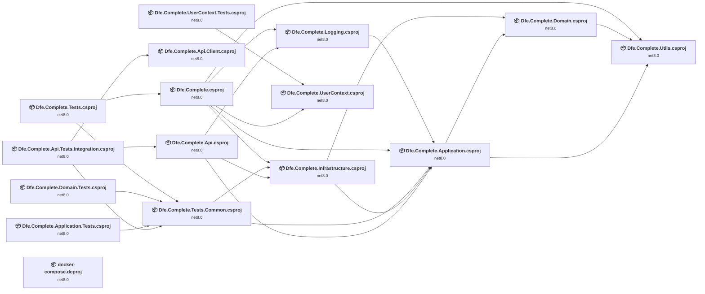

## Project Details

### docker-compose.dcproj

#### Project Info

- **Current Target Framework:** net8.0
- **Proposed Target Framework:** net10.0
- **SDK-style**: True
- **Project Kind:** DotNetCoreApp
- **Dependencies**: 0
- **Dependants**: 0
- **Number of Files**: 0
- **Number of Files with Incidents**: 1
- **Lines of Code**: 0
- **Estimated LOC to modify**: 0+ (at least 0.0% of the project)

#### Dependency Graph

Legend:
📦 SDK-style project
⚙️ Classic project

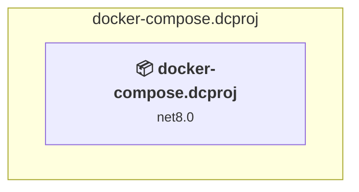

### API Compatibility

| Category | Count | Impact |
| :--- | :---: | :--- |
| 🔴 Binary Incompatible | 0 | High - Require code changes |
| 🟡 Source Incompatible | 0 | Medium - Needs re-compilation and potential conflicting API error fixing |
| 🔵 Behavioral change | 0 | Low - Behavioral changes that may require testing at runtime |
| ✅ Compatible | 0 |  |
| ***Total APIs Analyzed*** | ***0*** |  |

### src\Api\Dfe.Complete.Api.Client\Dfe.Complete.Api.Client.csproj

#### Project Info

- **Current Target Framework:** net8.0
- **Proposed Target Framework:** net10.0
- **SDK-style**: True
- **Project Kind:** ClassLibrary
- **Dependencies**: 0
- **Dependants**: 1
- **Number of Files**: 7
- **Number of Files with Incidents**: 4
- **Lines of Code**: 21105
- **Estimated LOC to modify**: 1597+ (at least 7.6% of the project)

#### Dependency Graph

Legend:
📦 SDK-style project
⚙️ Classic project

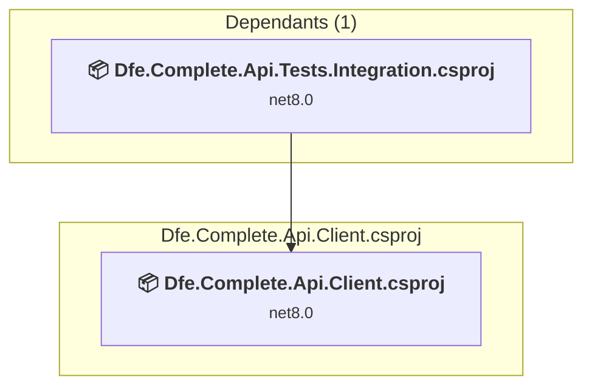

### API Compatibility

| Category | Count | Impact |
| :--- | :---: | :--- |
| 🔴 Binary Incompatible | 0 | High - Require code changes |
| 🟡 Source Incompatible | 0 | Medium - Needs re-compilation and potential conflicting API error fixing |
| 🔵 Behavioral change | 1597 | Low - Behavioral changes that may require testing at runtime |
| ✅ Compatible | 21557 |  |
| ***Total APIs Analyzed*** | ***23154*** |  |

### src\Api\Dfe.Complete.Api\Dfe.Complete.Api.csproj

#### Project Info

- **Current Target Framework:** net8.0
- **Proposed Target Framework:** net10.0
- **SDK-style**: True
- **Project Kind:** AspNetCore
- **Dependencies**: 3
- **Dependants**: 1
- **Number of Files**: 17
- **Number of Files with Incidents**: 2
- **Lines of Code**: 2707
- **Estimated LOC to modify**: 4+ (at least 0.1% of the project)

#### Dependency Graph

Legend:
📦 SDK-style project
⚙️ Classic project

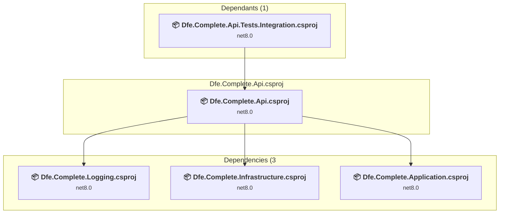

### API Compatibility

| Category | Count | Impact |
| :--- | :---: | :--- |
| 🔴 Binary Incompatible | 1 | High - Require code changes |
| 🟡 Source Incompatible | 2 | Medium - Needs re-compilation and potential conflicting API error fixing |
| 🔵 Behavioral change | 1 | Low - Behavioral changes that may require testing at runtime |
| ✅ Compatible | 3053 |  |
| ***Total APIs Analyzed*** | ***3057*** |  |

### src\Core\Dfe.Complete.Application\Dfe.Complete.Application.csproj

#### Project Info

- **Current Target Framework:** net8.0
- **Proposed Target Framework:** net10.0
- **SDK-style**: True
- **Project Kind:** ClassLibrary
- **Dependencies**: 2
- **Dependants**: 5
- **Number of Files**: 284
- **Number of Files with Incidents**: 4
- **Lines of Code**: 11416
- **Estimated LOC to modify**: 7+ (at least 0.1% of the project)

#### Dependency Graph

Legend:
📦 SDK-style project
⚙️ Classic project

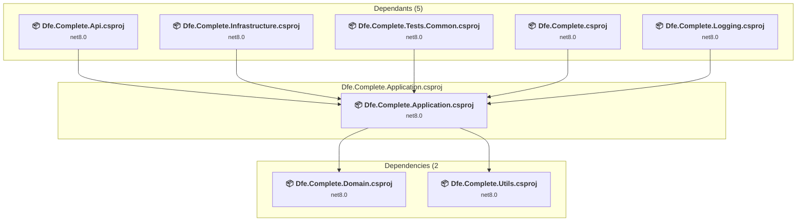

### API Compatibility

| Category | Count | Impact |
| :--- | :---: | :--- |
| 🔴 Binary Incompatible | 3 | High - Require code changes |
| 🟡 Source Incompatible | 4 | Medium - Needs re-compilation and potential conflicting API error fixing |
| 🔵 Behavioral change | 0 | Low - Behavioral changes that may require testing at runtime |
| ✅ Compatible | 15693 |  |
| ***Total APIs Analyzed*** | ***15700*** |  |

### src\Core\Dfe.Complete.Domain\Dfe.Complete.Domain.csproj

#### Project Info

- **Current Target Framework:** net8.0
- **Proposed Target Framework:** net10.0
- **SDK-style**: True
- **Project Kind:** ClassLibrary
- **Dependencies**: 1
- **Dependants**: 2
- **Number of Files**: 85
- **Number of Files with Incidents**: 2
- **Lines of Code**: 3177
- **Estimated LOC to modify**: 2+ (at least 0.1% of the project)

#### Dependency Graph

Legend:
📦 SDK-style project
⚙️ Classic project

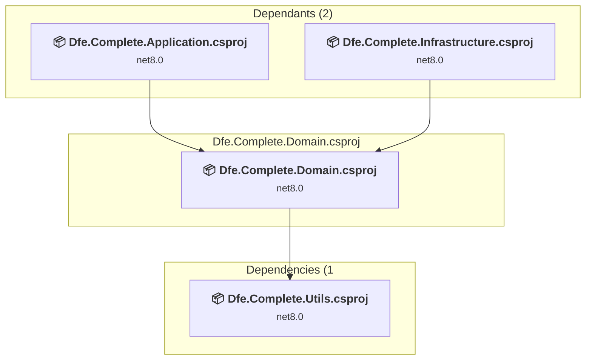

### API Compatibility

| Category | Count | Impact |
| :--- | :---: | :--- |
| 🔴 Binary Incompatible | 0 | High - Require code changes |
| 🟡 Source Incompatible | 2 | Medium - Needs re-compilation and potential conflicting API error fixing |
| 🔵 Behavioral change | 0 | Low - Behavioral changes that may require testing at runtime |
| ✅ Compatible | 3693 |  |
| ***Total APIs Analyzed*** | ***3695*** |  |

### src\Core\Dfe.Complete.Infrastructure\Dfe.Complete.Infrastructure.csproj

#### Project Info

- **Current Target Framework:** net8.0
- **Proposed Target Framework:** net10.0
- **SDK-style**: True
- **Project Kind:** ClassLibrary
- **Dependencies**: 2
- **Dependants**: 3
- **Number of Files**: 45
- **Number of Files with Incidents**: 7
- **Lines of Code**: 8215
- **Estimated LOC to modify**: 33+ (at least 0.4% of the project)

#### Dependency Graph

Legend:
📦 SDK-style project
⚙️ Classic project

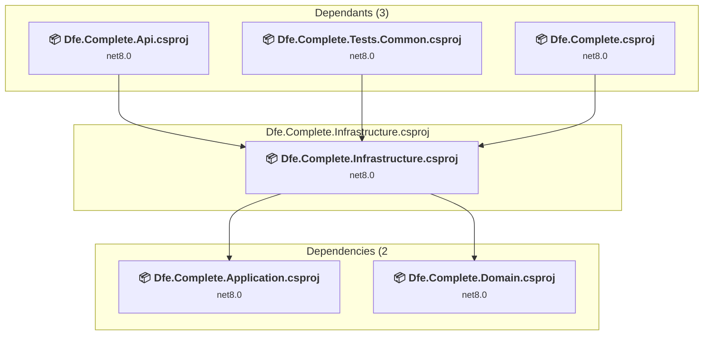

### API Compatibility

| Category | Count | Impact |
| :--- | :---: | :--- |
| 🔴 Binary Incompatible | 5 | High - Require code changes |
| 🟡 Source Incompatible | 22 | Medium - Needs re-compilation and potential conflicting API error fixing |
| 🔵 Behavioral change | 6 | Low - Behavioral changes that may require testing at runtime |
| ✅ Compatible | 14393 |  |
| ***Total APIs Analyzed*** | ***14426*** |  |

### src\Core\Dfe.Complete.Utils\Dfe.Complete.Utils.csproj

#### Project Info

- **Current Target Framework:** net8.0
- **Proposed Target Framework:** net10.0
- **SDK-style**: True
- **Project Kind:** ClassLibrary
- **Dependencies**: 0
- **Dependants**: 3
- **Number of Files**: 10
- **Number of Files with Incidents**: 1
- **Lines of Code**: 330
- **Estimated LOC to modify**: 0+ (at least 0.0% of the project)

#### Dependency Graph

Legend:
📦 SDK-style project
⚙️ Classic project

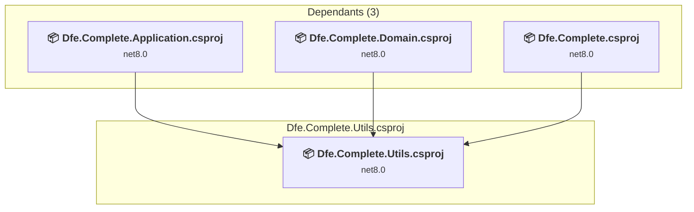

### API Compatibility

| Category | Count | Impact |
| :--- | :---: | :--- |
| 🔴 Binary Incompatible | 0 | High - Require code changes |
| 🟡 Source Incompatible | 0 | Medium - Needs re-compilation and potential conflicting API error fixing |
| 🔵 Behavioral change | 0 | Low - Behavioral changes that may require testing at runtime |
| ✅ Compatible | 446 |  |
| ***Total APIs Analyzed*** | ***446*** |  |

### src\Frontend\Dfe.Complete.Logging\Dfe.Complete.Logging.csproj

#### Project Info

- **Current Target Framework:** net8.0
- **Proposed Target Framework:** net10.0
- **SDK-style**: True
- **Project Kind:** ClassLibrary
- **Dependencies**: 1
- **Dependants**: 2
- **Number of Files**: 6
- **Number of Files with Incidents**: 1
- **Lines of Code**: 286
- **Estimated LOC to modify**: 0+ (at least 0.0% of the project)

#### Dependency Graph

Legend:
📦 SDK-style project
⚙️ Classic project

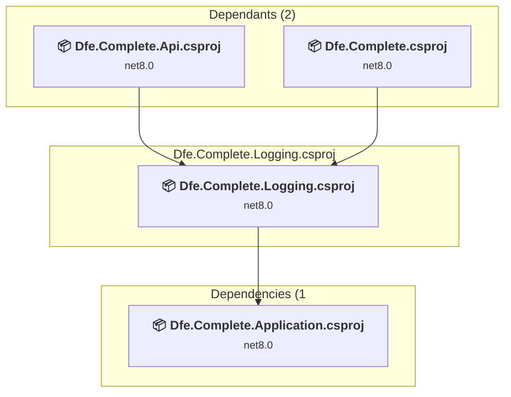

### API Compatibility

| Category | Count | Impact |
| :--- | :---: | :--- |
| 🔴 Binary Incompatible | 0 | High - Require code changes |
| 🟡 Source Incompatible | 0 | Medium - Needs re-compilation and potential conflicting API error fixing |
| 🔵 Behavioral change | 0 | Low - Behavioral changes that may require testing at runtime |
| ✅ Compatible | 444 |  |
| ***Total APIs Analyzed*** | ***444*** |  |

### src\Frontend\Dfe.Complete.UserContext\Dfe.Complete.UserContext.csproj

#### Project Info

- **Current Target Framework:** net8.0
- **Proposed Target Framework:** net10.0
- **SDK-style**: True
- **Project Kind:** ClassLibrary
- **Dependencies**: 0
- **Dependants**: 2
- **Number of Files**: 6
- **Number of Files with Incidents**: 1
- **Lines of Code**: 191
- **Estimated LOC to modify**: 0+ (at least 0.0% of the project)

#### Dependency Graph

Legend:
📦 SDK-style project
⚙️ Classic project

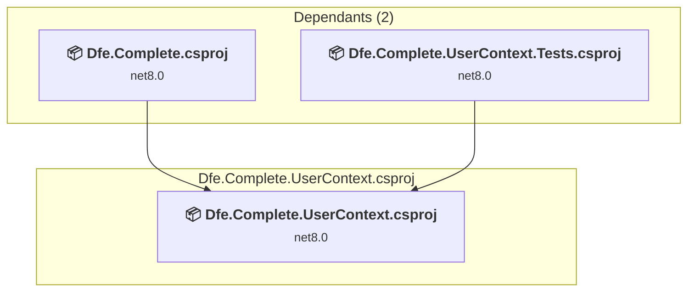

### API Compatibility

| Category | Count | Impact |
| :--- | :---: | :--- |
| 🔴 Binary Incompatible | 0 | High - Require code changes |
| 🟡 Source Incompatible | 0 | Medium - Needs re-compilation and potential conflicting API error fixing |
| 🔵 Behavioral change | 0 | Low - Behavioral changes that may require testing at runtime |
| ✅ Compatible | 201 |  |
| ***Total APIs Analyzed*** | ***201*** |  |

### src\Frontend\Dfe.Complete\Dfe.Complete.csproj

#### Project Info

- **Current Target Framework:** net8.0
- **Proposed Target Framework:** net10.0
- **SDK-style**: True
- **Project Kind:** AspNetCore
- **Dependencies**: 5
- **Dependants**: 1
- **Number of Files**: 751
- **Number of Files with Incidents**: 8
- **Lines of Code**: 29360
- **Estimated LOC to modify**: 31+ (at least 0.1% of the project)

#### Dependency Graph

Legend:
📦 SDK-style project
⚙️ Classic project

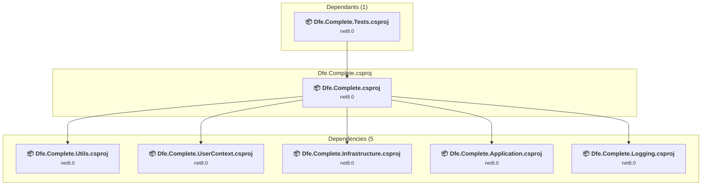

### API Compatibility

| Category | Count | Impact |
| :--- | :---: | :--- |
| 🔴 Binary Incompatible | 6 | High - Require code changes |
| 🟡 Source Incompatible | 12 | Medium - Needs re-compilation and potential conflicting API error fixing |
| 🔵 Behavioral change | 13 | Low - Behavioral changes that may require testing at runtime |
| ✅ Compatible | 144670 |  |
| ***Total APIs Analyzed*** | ***144701*** |  |

### src\Tests\Dfe.Complete.Api.Tests.Integration\Dfe.Complete.Api.Tests.Integration.csproj

#### Project Info

- **Current Target Framework:** net8.0
- **Proposed Target Framework:** net10.0
- **SDK-style**: True
- **Project Kind:** DotNetCoreApp
- **Dependencies**: 3
- **Dependants**: 0
- **Number of Files**: 61
- **Number of Files with Incidents**: 4
- **Lines of Code**: 12534
- **Estimated LOC to modify**: 19+ (at least 0.2% of the project)

#### Dependency Graph

Legend:
📦 SDK-style project
⚙️ Classic project

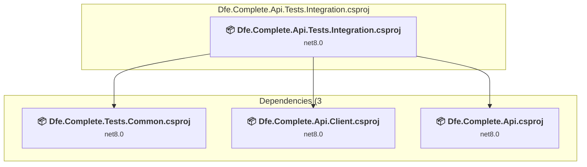

### API Compatibility

| Category | Count | Impact |
| :--- | :---: | :--- |
| 🔴 Binary Incompatible | 1 | High - Require code changes |
| 🟡 Source Incompatible | 0 | Medium - Needs re-compilation and potential conflicting API error fixing |
| 🔵 Behavioral change | 18 | Low - Behavioral changes that may require testing at runtime |
| ✅ Compatible | 26684 |  |
| ***Total APIs Analyzed*** | ***26703*** |  |

### src\Tests\Dfe.Complete.Application.Tests\Dfe.Complete.Application.Tests.csproj

#### Project Info

- **Current Target Framework:** net8.0
- **Proposed Target Framework:** net10.0
- **SDK-style**: True
- **Project Kind:** DotNetCoreApp
- **Dependencies**: 1
- **Dependants**: 0
- **Number of Files**: 113
- **Number of Files with Incidents**: 1
- **Lines of Code**: 13346
- **Estimated LOC to modify**: 0+ (at least 0.0% of the project)

#### Dependency Graph

Legend:
📦 SDK-style project
⚙️ Classic project

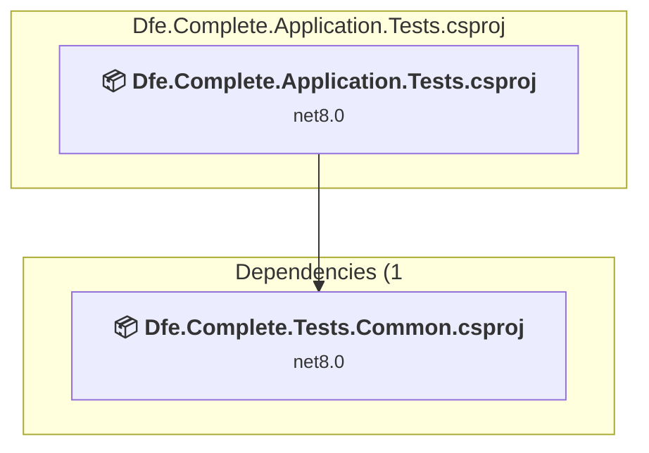

### API Compatibility

| Category | Count | Impact |
| :--- | :---: | :--- |
| 🔴 Binary Incompatible | 0 | High - Require code changes |
| 🟡 Source Incompatible | 0 | Medium - Needs re-compilation and potential conflicting API error fixing |
| 🔵 Behavioral change | 0 | Low - Behavioral changes that may require testing at runtime |
| ✅ Compatible | 28001 |  |
| ***Total APIs Analyzed*** | ***28001*** |  |

### src\Tests\Dfe.Complete.Domain.Tests\Dfe.Complete.Domain.Tests.csproj

#### Project Info

- **Current Target Framework:** net8.0
- **Proposed Target Framework:** net10.0
- **SDK-style**: True
- **Project Kind:** DotNetCoreApp
- **Dependencies**: 1
- **Dependants**: 0
- **Number of Files**: 14
- **Number of Files with Incidents**: 1
- **Lines of Code**: 1148
- **Estimated LOC to modify**: 0+ (at least 0.0% of the project)

#### Dependency Graph

Legend:
📦 SDK-style project
⚙️ Classic project

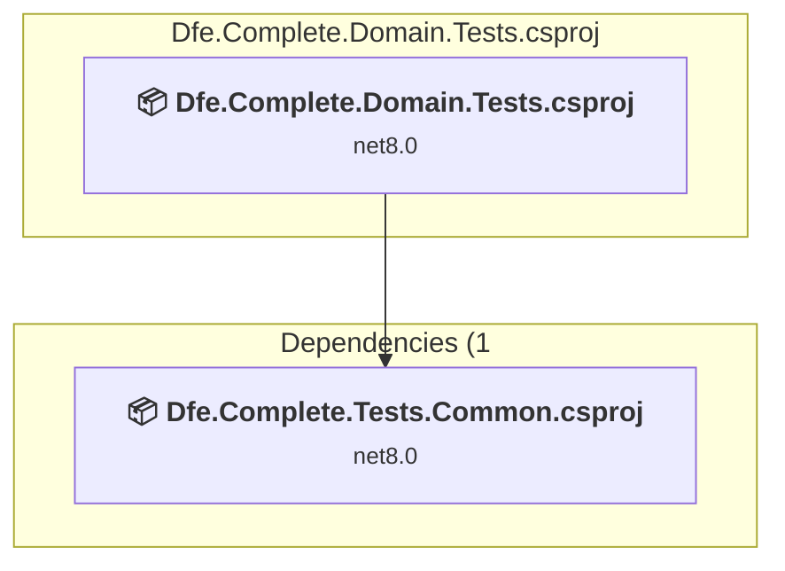

### API Compatibility

| Category | Count | Impact |
| :--- | :---: | :--- |
| 🔴 Binary Incompatible | 0 | High - Require code changes |
| 🟡 Source Incompatible | 0 | Medium - Needs re-compilation and potential conflicting API error fixing |
| 🔵 Behavioral change | 0 | Low - Behavioral changes that may require testing at runtime |
| ✅ Compatible | 2120 |  |
| ***Total APIs Analyzed*** | ***2120*** |  |

### src\Tests\Dfe.Complete.Tests.Common\Dfe.Complete.Tests.Common.csproj

#### Project Info

- **Current Target Framework:** net8.0
- **Proposed Target Framework:** net10.0
- **SDK-style**: True
- **Project Kind:** DotNetCoreApp
- **Dependencies**: 2
- **Dependants**: 4
- **Number of Files**: 35
- **Number of Files with Incidents**: 1
- **Lines of Code**: 961
- **Estimated LOC to modify**: 0+ (at least 0.0% of the project)

#### Dependency Graph

Legend:
📦 SDK-style project
⚙️ Classic project

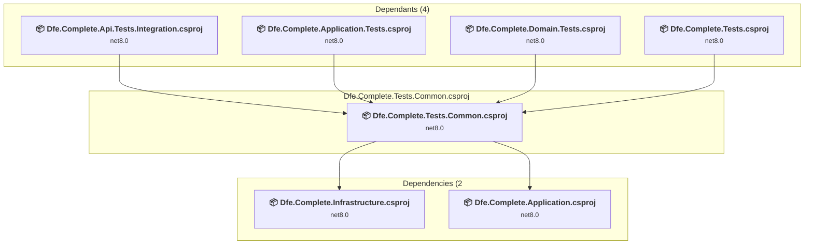

### API Compatibility

| Category | Count | Impact |
| :--- | :---: | :--- |
| 🔴 Binary Incompatible | 0 | High - Require code changes |
| 🟡 Source Incompatible | 0 | Medium - Needs re-compilation and potential conflicting API error fixing |
| 🔵 Behavioral change | 0 | Low - Behavioral changes that may require testing at runtime |
| ✅ Compatible | 1861 |  |
| ***Total APIs Analyzed*** | ***1861*** |  |

### src\Tests\Dfe.Complete.Tests\Dfe.Complete.Tests.csproj

#### Project Info

- **Current Target Framework:** net8.0
- **Proposed Target Framework:** net10.0
- **SDK-style**: True
- **Project Kind:** DotNetCoreApp
- **Dependencies**: 2
- **Dependants**: 0
- **Number of Files**: 78
- **Number of Files with Incidents**: 3
- **Lines of Code**: 11148
- **Estimated LOC to modify**: 79+ (at least 0.7% of the project)

#### Dependency Graph

Legend:
📦 SDK-style project
⚙️ Classic project

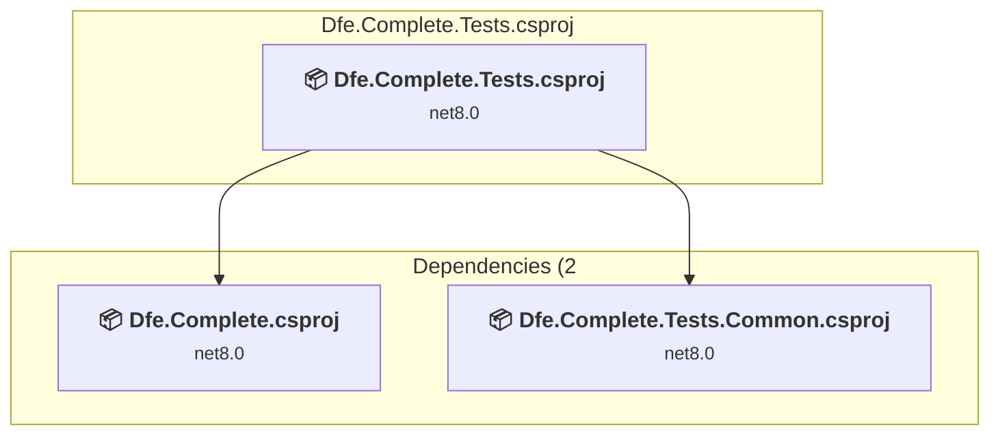

### API Compatibility

| Category | Count | Impact |
| :--- | :---: | :--- |
| 🔴 Binary Incompatible | 0 | High - Require code changes |
| 🟡 Source Incompatible | 79 | Medium - Needs re-compilation and potential conflicting API error fixing |
| 🔵 Behavioral change | 0 | Low - Behavioral changes that may require testing at runtime |
| ✅ Compatible | 17934 |  |
| ***Total APIs Analyzed*** | ***18013*** |  |

### src\Tests\Dfe.Complete.UserContext.Tests\Dfe.Complete.UserContext.Tests.csproj

#### Project Info

- **Current Target Framework:** net8.0
- **Proposed Target Framework:** net10.0
- **SDK-style**: True
- **Project Kind:** DotNetCoreApp
- **Dependencies**: 1
- **Dependants**: 0
- **Number of Files**: 5
- **Number of Files with Incidents**: 1
- **Lines of Code**: 161
- **Estimated LOC to modify**: 0+ (at least 0.0% of the project)

#### Dependency Graph

Legend:
📦 SDK-style project
⚙️ Classic project

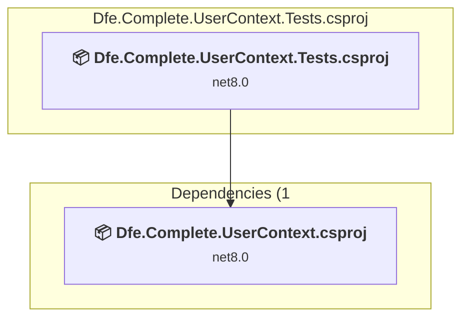

### API Compatibility

| Category | Count | Impact |
| :--- | :---: | :--- |
| 🔴 Binary Incompatible | 0 | High - Require code changes |
| 🟡 Source Incompatible | 0 | Medium - Needs re-compilation and potential conflicting API error fixing |
| 🔵 Behavioral change | 0 | Low - Behavioral changes that may require testing at runtime |
| ✅ Compatible | 262 |  |
| ***Total APIs Analyzed*** | ***262*** |  |

